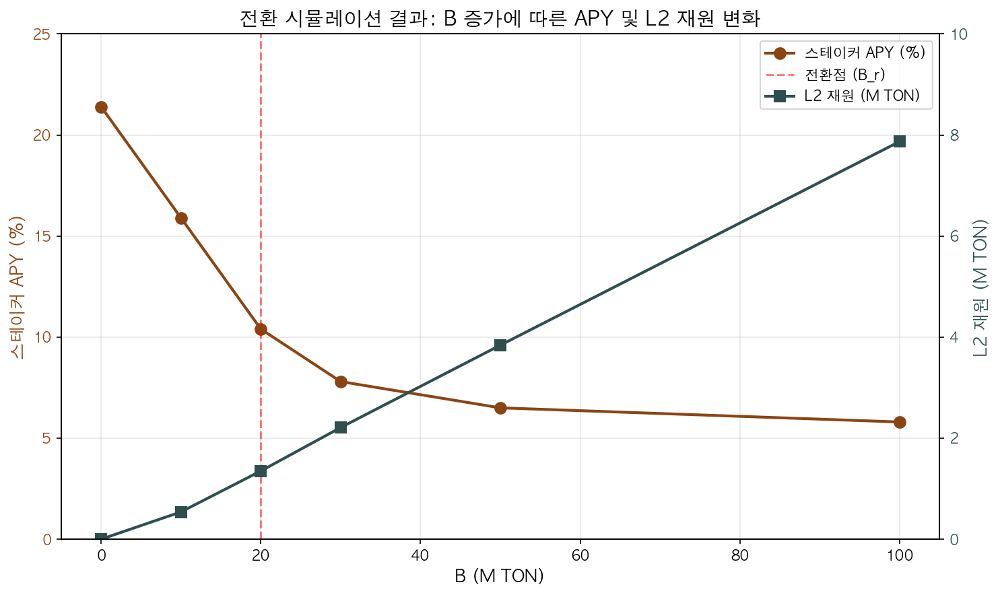
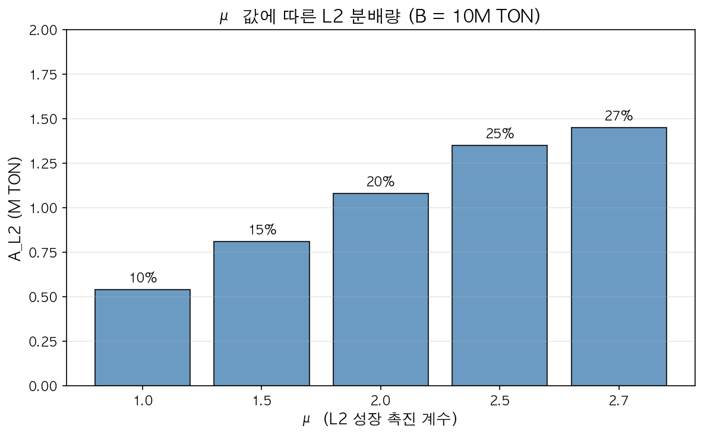

# Layer 2 전환 블록체인을 위한 동적 이중 인센티브 최적화 프레임워크

**저자**: Tokamak Network
**작성일**: 2025년 12월
**키워드**: 시뇨리지 분배, Layer 2 인센티브, 동적 전환 팩터, 이중 이해관계자 최적화, 블록체인 경제학

---

## 초록

블록체인 네트워크가 Layer 1에서 Layer 2 중심 아키텍처로 전환함에 따라, 기존 스테이커와 신규 L2 운영자 간의 인센티브 충돌이 구조적 문제로 대두되고 있다. 시뇨리지 발행량이 고정된 네트워크에서 L2 보상 재원은 기존 스테이커 몫에서 확보해야 하는 제로섬 제약이 존재하며, 이 갈등을 해결하지 못하면 스테이커 이탈 또는 L2 운영자 유치 실패라는 양 극단의 실패에 직면한다.

본 논문은 이러한 전환기의 인센티브 재분배 문제를 해결하기 위한 동적 이중 인센티브 시뇨리지 분배 프레임워크를 제안한다. 제안 프레임워크는 지분 시뇨리지와 추가 시뇨리지로 구성된 이중 구조를 통해 스테이커 보상을 세분화하고, L2 생태계 성장 지표에 연동하여 추가 시뇨리지가 먼저 감소한 후 지분 시뇨리지가 점진적으로 감소하는 r 선감소 원칙을 적용한다. 수학적 분석을 통해 제안 함수의 연속성, 단조 비증가 특성, 점근적 수렴을 증명하였으며, 토카막 네트워크 사례 연구를 통해 프레임워크의 실용성을 검증하였다.

---

## 1. 서론

### 1.1 L1→L2 전환의 구조적 딜레마

블록체인 네트워크의 확장성 문제를 해결하기 위한 Layer 2 솔루션이 보편화됨에 따라, L1 기반 블록체인들은 L2 중심 아키텍처로의 전환을 모색하고 있다. 이더리움 생태계에서 L2의 총 예치 가치(TVL)가 수백억 달러에 달하는 현실 [1]은 이러한 전환이 불가피함을 보여준다.

그러나 이 전환 과정에서 이해관계자 간 인센티브 충돌이라는 구조적 딜레마가 발생한다.

| 이해관계자 | 기대 | 우려 |
|------------|------|------|
| L1 스테이커 | 네트워크 보안 기여에 대한 지속적 보상 | L2 전환으로 인한 보상 감소 |
| L2 운영자 | 인프라 제공에 대한 정당한 보상 | 충분한 인센티브 없이 참여 유인 부족 |
| 네트워크 | 양측 모두의 참여를 통한 생태계 성장 | 한쪽의 이탈로 인한 시스템 붕괴 |

시뇨리지 발행량이 고정된 네트워크에서 L2에 분배할 재원은 기존 스테이커 몫에서 확보해야 하는 제로섬 제약이 존재한다. 이 갈등을 해결하지 못하면 다음과 같은 실패 모드에 직면한다. 첫째, 보상 감소에 불만을 품은 스테이커들이 네트워크를 떠나 급격한 토큰 매도를 유발하여 생태계에 치명적인 타격을 줄 수 있다. 둘째, 충분한 인센티브가 없어 L2 운영자가 참여하지 않아 L2 생태계 성장이 정체될 수 있다.

이러한 양 극단의 실패를 피하면서 점진적이고 예측 가능한 전환을 달성하는 것이 본 연구의 핵심 과제이다.

### 1.2 기존 접근법의 한계

L1→L2 전환기의 인센티브 분배 문제에 대해 기존 접근법들은 다음과 같은 한계를 보인다:

(1) 중앙화된 수익 귀속

현재 주요 L2 네트워크(Optimism, Arbitrum, Base, zkSync)는 단일 시퀀서 구조로 운영되며 수익이 중앙화된 팀에 귀속된다. 이 방식은 분배 문제 자체를 회피하지만, 탈중앙화라는 블록체인의 핵심 가치와 모순된다.

(2) 거버넌스 기반 수동 조정

| 한계 | 설명 |
|------|------|
| 정치적 불확실성 | 이해관계자 간 협상에 따라 결과가 달라짐 |
| 시장 충격 | 이산적(discrete) 파라미터 변경이 급격한 시장 반응 유발 |
| 예측 불가능성 | 참여자들이 미래 보상을 예측할 수 없음 |

(3) 고정 비율 분배

L1과 L2 간 고정 비율로 시뇨리지를 분배하는 방식은 생태계 성장 단계와 무관하게 동일한 비율을 적용하여, 초기에는 L2에 과다 분배되고 성숙기에는 과소 분배되는 비효율이 발생한다.

본 연구는 이러한 한계를 극복하기 위해 L2 생태계 성장 지표에 연동된 자동 조정 메커니즘을 제안한다.

### 1.3 연구 목표

본 연구의 목표는 다음과 같다:

1. L2 생태계 성장 지표(B)에 연동되어 자동으로 조정되는 동적 전환 팩터 설계
2. 스테이커의 지분 인정을 최대한 보호하는 r 선감소 원칙 정립
3. 스테이커, DAO, L2 운영자 간의 공정한 시뇨리지 분배 구조 설계
4. L2 성장 촉진 계수(μ)를 통한 유연한 인센티브 조절 메커니즘 제공

### 1.4 논문의 기여

본 논문의 주요 기여는 다음과 같다:

- 이중 시뇨리지 구조: 지분 시뇨리지(λσ)와 추가 시뇨리지(r)로 분리된 보상 체계 설계
- r 선감소 원칙: 스테이커 보호와 L2 전환의 균형을 달성하는 메커니즘
- 자기 안정화 특성: r > 0 구간에서 시스템의 자연스러운 균형 수렴 증명
- L2 성장 촉진 계수(μ): 거버넌스가 L2 인센티브 강도를 조절할 수 있는 파라미터
- 실증 검증: 토카막 네트워크 사례 연구를 통한 프레임워크 검증

### 1.5 논문 구성

본 논문은 다음과 같이 구성된다. 2장에서 관련 연구를 검토하고, 3장에서 시스템 모델을 정의한다. 4장에서 동적 전환 팩터를 설계하고, 5장에서 시뇨리지 분배 구조를 기술한다. 6장에서 수학적 특성을 분석하고, 7장에서 안정성을 검증한다. 8장에서 토카막 네트워크 사례 연구를 수행하고, 9장에서 한계점과 향후 연구를 논의하며, 10장에서 결론을 맺는다.

---

## 2. 관련 연구

### 2.1 블록체인 인센티브 메커니즘

블록체인 네트워크의 인센티브 설계는 참여자들의 행동을 유도하는 핵심 요소이다. Buterin et al. [2]은 지분증명(Proof-of-Stake) 시스템에서 검증자 인센티브 구조를 분석하였으며, 보상과 처벌의 균형이 네트워크 보안에 미치는 영향을 규명하였다. Roughgarden [3]은 트랜잭션 수수료 메커니즘 설계에서 인센티브 호환성(incentive compatibility)의 중요성을 강조하였다.

DeFi 프로토콜에서도 다양한 인센티브 메커니즘이 연구되었다. Compound [5]와 Aave [6]는 대출 프로토콜에서 이자율을 자동으로 조정하는 알고리즘적 접근법을 도입하였으며, 이는 본 연구의 동적 파라미터 조정 개념에 영향을 주었다.

### 2.2 Layer 2 확장성 솔루션

Layer 2 확장성 솔루션은 블록체인의 처리량 한계를 극복하기 위해 발전해왔다. Optimistic Rollup [7]과 Arbitrum [8]은 오프체인에서 트랜잭션을 처리하고 메인체인에 증명을 제출하는 방식으로 확장성을 달성한다. 그러나 이들 프로토콜의 경제적 인센티브 구조는 주로 시퀀서 운영에 집중되어 있으며, L1 스테이커와의 보상 분배 문제는 충분히 다루어지지 않았다.

### 2.3 시뇨리지 분배 연구

시뇨리지 분배에 관한 연구는 주로 스테이블코인 맥락에서 이루어졌다. MakerDAO [4]는 DAI 발행에서 발생하는 시뇨리지를 MKR 토큰 보유자에게 분배하는 구조를 설계하였다. 그러나 L1과 L2 간의 시뇨리지 분배를 다룬 연구는 제한적이며, 본 논문은 이 연구 공백을 해결하고자 한다.

### 2.4 본 연구의 차별점

기존 연구들이 L1 또는 L2 각각의 인센티브 설계에 집중한 반면, 본 연구는 L1에서 L2로의 전환 과정에서 발생하는 이해관계자 간 인센티브 재분배 문제를 명시적으로 다룬다. 특히 생태계 성장 지표에 연동된 동적 파라미터 조정 메커니즘을 제안함으로써, 거버넌스 기반 수동 조정의 한계를 극복하고자 한다.

---

## 3. 시스템 모델

### 3.1 상태 변수

시뇨리지 발행 블록체인의 상태를 다음과 같이 정의한다:

| 변수 | 정의 | 특성 |
|------|------|------|
| $S(t)$ | 시점 t에서의 총 스테이킹량 | 동적 |
| $B(t)$ | 시점 t에서의 L2 브릿지량 | 동적 |
| $T(t)$ | 시점 t에서의 총 토큰 공급량 | 시뇨리지에 의해 증가 |
| $A_{total}$ | 기간당 총 시뇨리지 발행량 | 고정 또는 예측 가능 |

### 3.2 비율 정의

스테이킹 비율 σ를 다음과 같이 정의한다:

$$\sigma = \frac{S}{T}$$

이 비율은 전체 토큰 공급량 대비 스테이킹된 토큰의 비율을 나타내며, 시뇨리지 분배 계산의 기본 단위가 된다.

### 3.3 파라미터 정의

제안 프레임워크는 다음 파라미터들로 구성된다:

| 파라미터 | 정의 | 역할 |
|----------|------|------|
| $r_0$ | 초기 추가 시뇨리지율 | 전환 전 스테이커 추가 보상 수준 |
| $B_r$ | r 제거 임계점 | r = 0이 되고 λ 감소가 시작되는 시점 |
| $\lambda_{min}$ | 최소 지분 시뇨리지율 | 스테이커 APY 하한 결정 |
| $k$ | 반포화 상수 | λ 감소 속도 조절 |
| $d$ | DAO 분배율 | DAO 기본 분배 비율 |
| $\mu$ | L2 성장 촉진 계수 | L2 인센티브 강도 조절 |

---

## 4. 동적 전환 팩터 설계

### 4.1 설계 원칙

동적 전환 팩터 설계의 핵심 원칙은 r 선감소, λ 후감소이다. 추가 시뇨리지(r)는 스테이커에게 주어지는 "보너스" 성격의 보상으로, 전환 과정에서 먼저 감소시켜야 한다. 반면 지분 시뇨리지(λ)는 스테이커가 예치한 "원금 대비 보상"으로, 최대한 나중에 감소시켜야 한다.

이 원칙은 스테이커의 지분 인정을 최대한 보호한다. 스테이커가 예치한 자본에 대한 기본 보상(λ)은 유지하면서, 추가 보너스(r)를 먼저 조정하는 것이 경제적으로 공정하다.

### 4.2 추가 시뇨리지율 r(B)

r은 L2 생태계 성장 초기에 스테이커에게 추가 인센티브를 제공하고, 임계점 $B_r$에서 0이 된다:

$$r(B) = r_0 \cdot \max\left(0, 1 - \frac{B}{B_r}\right)$$

특성:
- $B = 0$: $r(0) = r_0$ (초기 최대값)
- $B = B_r$: $r(B_r) = 0$ (임계점에서 소멸)
- $B > B_r$: $r = 0$ (유지)

이 공식에서 r은 B에 대해 선형으로 감소하며, $B_r$ 이후에는 0을 유지한다. 이는 L2 생태계가 충분히 성장한 후에는 추가 시뇨리지가 더 이상 필요하지 않음을 의미한다.

### 4.3 지분 시뇨리지율 λ(B)

λ는 r이 0이 된 이후($B > B_r$)부터 감소를 시작한다:

$$\lambda(B) = \lambda_{min} + (1 - \lambda_{min}) \cdot \frac{k}{k + \max(0, B - B_r)}$$

특성:
- $B \leq B_r$: $\lambda = 1$ (r 감소 구간에서 λ는 최대값 유지)
- $B > B_r$: λ가 쌍곡선 형태로 감소 시작
- $B \to \infty$: $\lambda \to \lambda_{min}$

이 설계는 r이 완전히 0이 될 때까지 스테이커의 지분 시뇨리지를 100% 보호한다.

### 4.4 r 선감소 원칙의 수학적 표현

두 함수의 상호작용을 정리하면:

| 구간 | $r(B)$ | $\lambda(B)$ | 특성 |
|------|--------|--------------|------|
| $B < B_r$ | $r_0(1-B/B_r)$ | 1 | r 감소, λ 고정 |
| $B = B_r$ | 0 | 1 | 전환점 |
| $B > B_r$ | 0 | 쌍곡선 감소 | r=0, λ 감소 |

---

## 5. 시뇨리지 분배 구조

### 5.1 이중 시뇨리지 모델

스테이커에게 분배되는 시뇨리지는 두 구성요소의 합으로 계산된다:

$$S_{staker} = A_{total} \cdot \left[\lambda(B) \cdot \sigma + r(B) \cdot (1 - \lambda(B) \cdot \sigma)\right]$$

여기서:
- $\lambda(B) \cdot \sigma$: 지분 시뇨리지 - 스테이킹 비율에 비례한 기본 분배
- $r(B) \cdot (1 - \lambda(B) \cdot \sigma)$: 추가 시뇨리지 - 스테이커에게 주는 추가 인센티브

이 구조는 스테이커에게 이중 보상을 제공하면서, L2 전환에 따라 각 구성요소를 독립적으로 조정할 수 있게 한다.

### 5.2 분배 우선순위

본 프레임워크는 다음과 같은 명확한 분배 우선순위를 정의한다:

1. 스테이커: 이중 시뇨리지 구조에 따른 분배
2. DAO 기본 분배: 남은 재원에서 고정 비율(d) 분배
3. L2 운영자: DAO 기본 분배 후 남은 재원에서 분배
4. DAO 잔여: L2가 가져가지 않은 나머지 귀속

### 5.3 남은 재원 계산

스테이커 분배 후 남은 재원:

$$A_{remainder} = A_{total} \cdot (1 - \lambda(B) \cdot \sigma) \cdot (1 - r(B))$$

이 재원이 DAO와 L2 운영자에게 분배된다.

### 5.4 DAO 분배

DAO는 남은 재원에서 지분율 d만큼 먼저 분배받는다:

$$A_{DAO,base} = A_{remainder} \cdot d$$

### 5.5 L2 운영자 분배

DAO 기본 분배 후 남은 재원에서 L2가 분배받는다:

$$A_{L2,pool} = A_{remainder} \cdot (1 - d)$$

각 L2별 분배:

$$A_{L2,i} = A_{L2,pool} \cdot \frac{B_i}{T} \cdot \mu$$

여기서 $\mu$는 L2 성장 촉진 계수이다. 이 계수의 역할은 다음과 같다:

- $\mu > 1$: 브릿지된 TON보다 많은 지분을 초과 지급 (L2 성장 촉진)
- $\mu = 1$: 브릿지된 TON 비율만큼 분배
- $\mu < 1$: 브릿지된 TON 비율보다 적게 분배

전체 L2 분배:

$$A_{L2,total} = A_{L2,pool} \cdot \frac{\sum_j B_j}{T} \cdot \mu$$

제약 조건:

L2 전체 분배는 풀을 초과할 수 없다:

$$A_{L2,total} \leq A_{L2,pool}$$

따라서 μ의 상한은:

$$\mu \leq \frac{T}{\sum_j B_j}$$

### 5.6 DAO 잔여 분배

L2가 가져가지 않은 나머지는 DAO에 귀속된다:

$$A_{DAO,extra} = A_{L2,pool} - A_{L2,total}$$

DAO 총 분배:

$$A_{DAO,total} = A_{DAO,base} + A_{DAO,extra}$$

### 5.7 분배 흐름도

전체 시뇨리지 분배 흐름을 도식화하면:

```
A_total (전체 시뇨리지)
    │
    ├──→ S_staker = A × [λσ + r(1-λσ)]
    │
    └──→ A_remainder = A × (1-λσ)(1-r)
              │
              ├──→ A_DAO,base = A_remainder × d
              │
              └──→ A_L2,pool = A_remainder × (1-d)
                        │
                        ├──→ A_L2,i = A_L2,pool × (B_i/T) × μ
                        │
                        └──→ A_DAO,extra = A_L2,pool - A_L2,total
```

---

## 6. 수학적 특성

### 6.1 연속성

**정리 1**: r(B)와 λ(B)는 $B \in [0, \infty)$에서 연속이다.

**증명**:

r(B)의 경우, $B < B_r$에서는 선형 함수 $r_0(1 - B/B_r)$이고, $B \geq B_r$에서는 상수 0이다. $B = B_r$에서:

$$\lim_{B \to B_r^{-}} r(B) = r_0 \cdot 0 = 0 = r(B_r)$$

따라서 r(B)는 연속이다.

λ(B)의 경우, $B < B_r$에서는 상수 1이고, $B \geq B_r$에서는 쌍곡선 함수이다. $B = B_r$에서:

$$\lim_{B \to B_r^{+}} \lambda(B) = \lambda_{min} + (1-\lambda_{min}) \cdot 1 = 1 = \lim_{B \to B_r^{-}} \lambda(B)$$

따라서 λ(B)도 연속이다. ∎

### 6.2 단조 비증가 특성

**정리 2**: r(B)와 λ(B)는 B에 대해 단조 비증가(monotonically non-increasing)한다. 구체적으로, r(B)는 $B \in [0, B_r]$에서 단조 감소하고 $B > B_r$에서 0을 유지하며, λ(B)는 $B \in [0, B_r]$에서 1을 유지하고 $B \in [B_r, \infty)$에서 단조 감소한다.

**증명**:

**r(B)의 경우:**
- $B < B_r$에서: $\frac{dr}{dB} = -\frac{r_0}{B_r} < 0$ (단조 감소)
- $B > B_r$에서: $r(B) = 0$ (상수)

**λ(B)의 경우:**
- $B < B_r$에서: $\lambda(B) = 1$ (상수)
- $B > B_r$에서: $\frac{d\lambda}{dB} = -(1-\lambda_{min}) \cdot \frac{k}{(k+B-B_r)^{2}} < 0$ (단조 감소)

따라서 두 함수 모두 B에 대해 단조 비증가하며, 엄밀한 단조 감소가 아닌 구간별로 감소 또는 상수를 유지한다. ∎

### 6.3 점근적 수렴

**정리 3**: $B \to \infty$일 때 $\lambda(B) \to \lambda_{min}$

**증명**:

$$\lim_{B \to \infty} \lambda(B) = \lambda_{min} + (1-\lambda_{min}) \cdot \lim_{B \to \infty} \frac{k}{k+B-B_r} = \lambda_{min}$$

분모가 무한대로 발산하므로 두 번째 항은 0으로 수렴한다. ∎

### 6.4 반감점

**정의**: λ가 $(1 + \lambda_{min})/2$가 되는 B 값을 반감점이라 한다.

**계산**:

$$\lambda(B^\ast) = \lambda_{min} + (1-\lambda_{min}) \cdot \frac{k}{k+B^\ast-B_r} = \frac{1+\lambda_{min}}{2}$$

이를 정리하면:

$$B^\ast = B_r + k$$

**의미**: $B = B_r + k$일 때 λ 전환이 절반 완료된다.

---

## 7. 안정성 분석

### 7.1 스테이커 APY

스테이커의 연간 수익률(APY)은 다음과 같이 계산된다:

$$APY_S = \frac{S_{staker}}{S} = \frac{A_{total}}{S} \cdot \left[\lambda \sigma + r(1-\lambda\sigma)\right]$$

### 7.2 자기 안정화 메커니즘

**정리 4**: r > 0인 구간에서 $\frac{\partial APY_S}{\partial S} < 0$이다.

**증명**:

$$\frac{\partial APY_S}{\partial S} = -\frac{A_{total}}{S^{2}} \cdot \left[\lambda \sigma + r(1-\lambda\sigma)\right]$$

$\lambda, \sigma, r \geq 0$이고 $A_{total} > 0$이므로, 이 값은 항상 음수이다. ∎

**의미**: 스테이킹량 S가 증가하면 APY가 감소하고, S가 감소하면 APY가 증가한다. 이로 인해 시스템은 자연스럽게 균형점으로 수렴한다.

### 7.3 B 변동에 대한 시스템 반응

L2 브릿지량 B가 증가하면:

1. 1단계 (B < B_r): r 감소로 인한 스테이커 APY 감소
2. 2단계 (B > B_r): λ 감소로 인한 스테이커 APY 추가 감소
3. $APY_S < APY_{market}$이 되면 일부 스테이커 이탈
4. L2 재원 증가로 L2 유입 유치를 위한 동기부여 제공 및 재정 지원 역할 수행

---

## 8. 사례 연구: 토카막 네트워크

### 8.1 네트워크 현황

토카막 네트워크는 TON 토큰을 발행하는 시뇨리지 기반 블록체인으로, 2025년 현재 다음과 같은 상태이다:

| 지표 | 값 |
|------|-----|
| 시뇨리지 발행 | 블록당 3.92 TON |
| 연간 발행량 ($A_{total}$) | 10,308,816 TON |
| 총 스테이킹량 (S) | 27,234,159 TON |
| 총 공급량 (T) | ~100,000,000 TON |
| 스테이킹 비율 (σ) | 27.4% |

### 8.2 권장 파라미터

본 프레임워크를 토카막 네트워크에 적용하기 위한 권장 파라미터:

| 파라미터 | 권장값 | 근거 |
|----------|--------|------|
| $r_0$ | 0.4 | 초기 높은 스테이커 인센티브 제공 |
| $B_r$ | 20M TON | 스테이킹량의 약 73% 수준 |
| $\lambda_{min}$ | 0.5 | 최종 APY 약 5% 보장 |
| $k$ | 10M TON | 완만한 2단계 전환 |
| $d$ | 0.1 | DAO 기본 분배 10% |

$\lambda_{min} = 0.5$의 근거:

목표 최소 APY를 5%로 설정하면:

$$\lambda_{min} = \frac{APY_{min} \cdot S}{A_{total} \cdot \sigma} = \frac{0.05 \times 27,234,159}{10,308,816 \times 0.274} \approx 0.48$$

실용적 편의를 위해 0.5로 설정한다.

**반포화 상수 k의 역할:**

k는 2단계(B > B_r)에서 λ가 감소하는 속도를 조절하는 핵심 파라미터이다. λ(B) 함수에서 k의 수학적 의미를 분석하면:

$$\lambda(B) = \lambda_{min} + (1 - \lambda_{min}) \cdot \frac{k}{k + (B - B_r)}$$

k가 클수록 분모의 증가 속도가 상대적으로 느려져 λ 감소가 완만해진다. Section 6.4에서 정의한 반감점에서:

$$B^\ast = B_r + k$$

즉, k는 λ가 초기값(1)과 최종값($\lambda_{min}$)의 중간점에 도달하는 데 필요한 추가 브릿지량을 의미한다.

**k 값에 따른 λ 전환 비교** (B_r = 20M, $\lambda_{min}$ = 0.5 기준):

| k (M TON) | 반감점 B* | B=30M에서 λ | B=50M에서 λ | B=100M에서 λ | 전환 특성 |
|-----------|-----------|-------------|-------------|--------------|-----------|
| 5 | 25M | 0.67 | 0.58 | 0.53 | 급격한 전환 |
| 10 | 30M | 0.75 | 0.62 | 0.56 | 완만한 전환 (권장) |
| 20 | 40M | 0.83 | 0.70 | 0.59 | 매우 완만한 전환 |
| 30 | 50M | 0.88 | 0.75 | 0.62 | 초완만 전환 |

**k 설정 전략:**

| 전략 | k 값 | 적용 상황 | 효과 |
|------|------|----------|------|
| 빠른 전환 | 5M | L2 생태계 급성장 예상 시 | 스테이커 APY가 빠르게 하락, L2 재원 빠르게 확보 |
| 균형 전환 | 10M | 일반적 상황 (권장) | 스테이커에게 적응 시간 제공, 점진적 전환 |
| 보수적 전환 | 20M+ | 스테이커 이탈 우려 시 | 스테이커 APY 장기간 높게 유지, L2 재원 확보 지연 |

**k 선택 시 고려사항:**

1. 스테이커 심리: k가 작으면 APY 급락으로 스테이커 불안 유발
2. L2 성장 속도: k가 크면 L2 재원 확보가 지연되어 초기 성장 저해
3. 시장 상황: 약세장에서는 큰 k로 스테이커 보호, 강세장에서는 작은 k로 전환 가속
4. 경쟁 환경: 경쟁 L2가 있다면 작은 k로 빠른 재원 확보 필요

k = 10M TON 권장 근거: 스테이킹량(27M)의 약 37% 수준으로, B가 B_r(20M)에서 30M으로 증가할 때 λ가 1에서 0.75로 완만하게 감소하여 스테이커에게 충분한 적응 시간을 제공한다.

### 8.3 전환 시뮬레이션

다양한 B 값에서의 시뮬레이션 결과 (μ = 1.0, T = 100M TON 고정 가정)*:

| B (M TON) | B/T | r(B) | λ(B) | APY_S | A_L2 (M TON) | APY_L2 | 단계 |
|-----------|-----|------|------|-------|--------------|--------|------|
| 0 | 0% | 0.40 | 1.00 | 21.4% | 0.00 | - | 1단계 |
| 10 | 10% | 0.20 | 1.00 | 15.9% | 0.54 | 5.4% | 1단계 |
| 20 | 20% | 0.00 | 1.00 | 10.4% | 1.35 | 6.7% | 전환점 |
| 30 | 30% | 0.00 | 0.75 | 7.8% | 2.21 | 7.4% | 2단계 |
| 50 | 50% | 0.00 | 0.62 | 6.5% | 3.84 | 7.7% | 2단계 |
| 100 | 100% | 0.00 | 0.56 | 5.8% | 7.87 | 7.9% | 2단계 |

*주: 실제로는 시뇨리지 발행(연간 ~10.3M TON)으로 T가 지속 증가하므로, 동일한 B에서 B/T 비율은 시간이 지남에 따라 감소한다. APY_L2는 브릿지된 자산 대비 L2 운영자의 연간 수익률(A_L2/B)을 나타낸다.



**Figure 1**: 전환 시뮬레이션 결과. B(L2 브릿지량) 증가에 따른 스테이커 APY와 L2 재원의 변화를 보여준다. B < 20M TON 구간에서 λ = 1이 유지되며, 스테이커 APY는 21.4%에서 5.8%까지 점진적으로 감소한다. 동시에 L2 분배 재원은 0에서 7.87M TON까지 단조 증가한다.

**단계별 해석:**

(1) 1단계 (B = 0~20M, B/T = 0~20%): 초기 성장기

r이 감소하는 구간(0.4 → 0)이며 λ = 1로 고정된다. 스테이커 APY가 15.9~21.4%로 높게 유지되는 반면, L2 APY는 5.4~6.7%로 상대적으로 낮다. 이 구간에서는 스테이커 인센티브가 우선시되며, L2 성장을 촉진하려면 μ를 높게 설정하는 전략이 필요하다.

(2) 전환점 (B = 20M, B/T = 20%)

r = 0에 도달하고 λ 감소가 시작되는 임계점이다. 스테이커 APY는 10.4%, L2 APY는 6.7%이다. 이 시점부터 스테이커 보상이 본격적으로 감소하기 시작하며, L2 재원이 증가한다.

(3) 2단계 (B = 30~100M, B/T = 30~100%): 성숙기

r = 0이고 λ가 감소(1 → 0.56)하는 구간이다. 스테이커 APY는 7.8%에서 5.8%로 감소하고, L2 APY는 7.4%에서 7.9%로 소폭 증가한다. B = 100M에서 APY_S(5.8%) ≈ APY_L2(7.9%)로 양측 인센티브가 유사한 수준에 수렴한다.

### 8.4 L2 성장 촉진 계수(μ) 영향 분석

초기 L2 생태계 성장을 촉진하기 위해 μ 값을 높게 설정하는 전략을 고려할 수 있다. 다음은 B = 10M TON (초기 성장 단계)에서 다양한 μ 값에 따른 L2 분배 결과이다:

| μ | A_L2 (M TON) | APY_L2 | L2 풀 대비 비율 |
|---|--------------|--------|----------------|
| 1.0 | 0.54 | 5.4% | 10% |
| 1.5 | 0.81 | 8.1% | 15% |
| 2.0 | 1.08 | 10.8% | 20% |
| 2.5 | 1.35 | 13.5% | 25% |
| 2.7 | 1.45 | 14.5% | 27% |



**Figure 2**: L2 성장 촉진 계수(μ) 값에 따른 L2 분배량 변화 (B = 10M TON 기준). μ가 증가함에 따라 L2 분배량이 비례적으로 증가하며, 막대 위의 수치는 L2 풀(A_L2,pool) 대비 비율을 나타낸다.

μ 값에 따른 인센티브 구조를 분석하면 다음과 같다. μ = 1.0일 때 L2 APY(5.4%)는 동일 조건에서의 스테이커 APY(15.9%)보다 낮아 L2 운영자 유치에 불리하다. μ = 2.0으로 설정할 경우 L2 APY는 10.8%로 상승하지만 여전히 스테이커 APY보다 낮다. L2 APY가 스테이커 APY와 균형을 이루려면 약 μ = 3.0 이상이 필요하다. 이는 Section 5.5의 수식에서 L2 분배가 B/T 비율에 비례하기 때문이며, 초기 L2 생태계 구축 단계에서는 μ를 충분히 높게 설정하거나 L2 분배 수식의 재검토가 필요할 수 있다.

μ 상한값 계산 (B = 10M TON 기준):

$$\mu_{max} = \frac{T}{B} = \frac{100M}{10M} = 10$$

μ = 10일 때 L2가 풀(A_L2,pool)의 100%를 가져가며, 이것이 수학적 상한이다. B가 증가하면 상한이 낮아진다:

| B (M TON) | μ_max | 의미 |
|-----------|-------|------|
| 10 | 10.0 | L2 풀 100% 분배 가능 |
| 20 | 5.0 | L2 풀 100% 분배 가능 |
| 50 | 2.0 | L2 풀 100% 분배 가능 |
| 100 | 1.0 | μ > 1 불가 |

초기 μ 설정 전략:

| 전략 | μ 초기값 | 장점 | 단점 |
|------|----------|------|------|
| 보수적 | 1.0~1.2 | 안정적 전환 | L2 성장 동력 부족 |
| 균형 | 1.5~2.0 | 적정 인센티브 | - |
| 적극적 | 2.0~2.5 | 강한 성장 동력 | DAO 잔여 분배 감소 |

초기에 μ를 높게 설정하여 L2 운영자에게 강한 인센티브를 제공하고, L2 생태계가 성숙함에 따라 DAO 거버넌스를 통해 μ를 점진적으로 낮추는 전략이 가능하다. 이는 전략적 의사결정으로서 DAO가 네트워크 상황에 맞게 조정할 수 있다.

### 8.5 시뮬레이션 결과 분석

Figure 1은 B(L2 브릿지량) 변화에 따른 주요 지표의 추이를 시각화한다. 시뮬레이션 결과에서 다음과 같은 주요 관찰을 도출할 수 있다:

1. r 선감소 원칙 확인: B < 20M TON 구간에서 λ = 1이 유지된다.
2. 점진적 전환: 스테이커 APY가 21.4%에서 5.8%까지 점진적으로 감소한다.
3. L2 재원 단조 증가: B 증가에 따라 L2 분배 재원이 0에서 7.87M TON까지 증가한다.
4. APY 수렴: B = 100M에서 스테이커 APY(5.8%)와 L2 APY(7.9%)가 유사한 수준에 수렴한다.
5. 균형 구간 존재: B = 20M~50M TON 구간에서 양측 모두 합리적 인센티브를 확보한다.

**인센티브 균형점 분석:**

| B (M TON) | APY_S | APY_L2 | 차이 | 특성 |
|-----------|-------|--------|------|------|
| 20 | 10.4% | 6.7% | +3.7%p | 스테이커 우위 |
| 30 | 7.8% | 7.4% | +0.4%p | 균형점 |
| 50 | 6.5% | 7.7% | -1.2%p | L2 우위 |

B ≈ 30M TON(총 공급량의 30%)에서 스테이커 APY와 L2 APY가 약 7.5% 수준으로 수렴하며, 이 지점이 양측 인센티브의 균형점이 된다. 이 균형 구간(20M~50M)에서는 스테이커와 L2 운영자 모두 5~10% 범위의 합리적인 수익률을 확보할 수 있어, 네트워크의 안정적 전환이 가능하다.

### 8.6 전환 시나리오

현재 상태 (B = 0):
- r = 0.4, λ = 1.0
- APY_S = 21.4%
- L2 재원 = 0

중간 상태 (B = 20M, 전환점):
- r = 0, λ = 1.0
- APY_S = 10.4%
- L2 재원 = 1.35M TON

목표 상태 (B = 50M):
- r = 0, λ = 0.62
- APY_S = 6.5%
- L2 재원 = 3.84M TON

---

## 9. 한계점과 향후 연구

본 절에서는 제안 프레임워크의 한계점을 논의하고 향후 연구 방향을 제시한다. 구현 관련 코드는 부록 C에 수록하였다.

### 9.1 역전환 방지

현재 프레임워크에서 B가 감소하면 λ(B)와 r(B)가 증가하여 전환이 되돌아갈 수 있다. 역전환을 방지하려면 High Water Mark 메커니즘을 도입할 수 있다:

$$\Phi(t) = \max(\Phi(t-1), B(t))$$

λ(B) 대신 λ(Φ)를 사용하여 전환 지표가 단조 증가하도록 설계한다.

### 9.2 V3 L2 분배 방식 통합

향후 V3 백서의 쌍곡선 L2 분배 함수 적용을 검토한다:

$$y(x) = L \cdot \frac{x}{k + x}$$

여기서 $L = (1-d) \times A_{total}$이다. 이 방식은 초기 L2 성장에 강한 인센티브를 제공하면서 대형 L2로의 집중을 방지한다.

### 9.3 토큰 가격 변동 반영

본 프레임워크의 스테이커 APY 모델은 토큰 수량 기준 APY만을 고려하며, 다음 요소들은 반영하지 않는다:

- 토큰 가격 변동: 토큰 가격 상승/하락에 따른 실질 수익률 변화
- USD 기준 실질 수익: 법정화폐 기준의 실제 투자 수익
- 인플레이션 희석 효과: 시뇨리지 발행으로 인한 기존 보유자의 지분 희석

향후 연구에서는 토큰 가격 $P(t)$를 포함한 확장 모델을 검토할 수 있다:

$$APY_{real} = \frac{P(t+1)}{P(t)} \cdot (1 + APY_S) - 1$$

이를 통해 스테이커의 실질적인 의사결정 모델을 보다 정교하게 반영할 수 있다.

---

## 10. 결론

블록체인 네트워크가 L1에서 L2 중심 아키텍처로 전환하는 과정에서 기존 스테이커와 신규 L2 운영자 간의 인센티브 충돌은 피할 수 없는 구조적 문제이다. 시뇨리지 발행량이 고정된 환경에서 L2 보상 재원은 기존 스테이커 몫에서 확보해야 하는 제로섬 제약이 존재하며, 이 갈등을 해결하지 못하면 스테이커 대량 이탈 또는 L2 생태계 성장 실패라는 양 극단의 실패에 직면한다.

본 논문은 이러한 L1→L2 전환기의 인센티브 재분배 문제를 해결하기 위한 동적 이중 인센티브 최적화 프레임워크를 제안하였다. 본 연구의 핵심 기여는 다음과 같다. 첫째, 지분 시뇨리지(λσ)와 추가 시뇨리지(r)로 분리된 이중 시뇨리지 구조를 통해 스테이커 보상을 세분화하였다. 둘째, r 선감소 원칙을 통해 L2 성장에 따라 추가 시뇨리지가 먼저 감소하여 스테이커 지분 인정을 보호하면서 점진적 전환을 달성하였다. 셋째, r > 0 구간에서 APY 자동 조절을 통한 자기 안정화 메커니즘을 증명하였다. 넷째, 스테이커, DAO, L2, DAO(잔여) 순서의 명확한 분배 우선순위를 정의하였다. 다섯째, L2 성장 촉진 계수(μ)를 도입하여 거버넌스가 L2 인센티브 강도를 조절할 수 있는 유연한 메커니즘을 제공하였다.

제안 프레임워크는 거버넌스 기반 수동 조정의 불확실성을 제거하고, 예측 가능하며 시장 친화적인 L2 전환 경로를 제공한다. 토카막 네트워크 사례 연구는 프레임워크가 실제 네트워크에 적용 가능함을 입증하며, L2 전환을 계획하는 다른 시뇨리지 발행 블록체인에도 적용될 수 있음을 시사한다.

---

## 참고문헌

[1] L2Beat. (2025). Ethereum Layer 2 TVL Statistics. Retrieved from https://l2beat.com

[2] Buterin, V., Hernandez, D., Kamphefner, T., et al. (2020). Combining GHOST and Casper. arXiv preprint arXiv:2003.03052.

[3] Roughgarden, T. (2021). Transaction Fee Mechanism Design. ACM SIGecom Exchanges, 19(1), 52-55.

[4] MakerDAO. (2017). The Dai Stablecoin System. Technical White Paper.

[5] Leshner, R., & Hayes, G. (2019). Compound: The Money Market Protocol. Technical White Paper.

[6] Aave. (2020). Aave Protocol Whitepaper v2.0. Technical Documentation.

[7] Optimism Foundation. (2023). Optimism: A Scalable Layer 2 Rollup. Technical Specification.

[8] Offchain Labs. (2024). Arbitrum Rollup Protocol Specification. Technical Documentation.

[9] Saleh, F. (2021). Blockchain Without Waste: Proof-of-Stake. The Review of Financial Studies, 34(3), 1156-1190.

[10] Chitra, T., & Evans, A. (2022). Why Stake When You Can Borrow? arXiv preprint arXiv:2006.11156.

[11] Daian, P., Goldfeder, S., Kell, T., et al. (2020). Flash Boys 2.0: Frontrunning in Decentralized Exchanges, Miner Extractable Value, and Consensus Instability. IEEE Symposium on Security and Privacy, 910-927.

---

## 부록 A: 기호 정의

| 기호 | 정의 |
|------|------|
| $A_{total}$ | 기간당 총 시뇨리지 발행량 |
| $S$ | 총 스테이킹량 |
| $B$ | L2 브릿지량 |
| $T$ | 총 토큰 공급량 |
| $\sigma$ | 스테이킹 비율 (S/T) |
| $r_0$ | 초기 추가 시뇨리지율 |
| $r(B)$ | 추가 시뇨리지율 함수 |
| $B_r$ | r이 0이 되는 임계점 |
| $\lambda(B)$ | 지분 시뇨리지율 함수 |
| $\lambda_{min}$ | 최소 지분 시뇨리지율 |
| $k$ | 반포화 상수 |
| $d$ | DAO 분배율 |
| $\mu$ | L2 성장 촉진 계수 |
| $APY_S$ | 스테이커 연간 수익률 |

---

## 부록 B: 수학적 증명

### B.1 시장 충격의 단조 감소

$B > B_r$에서 스테이커 APY의 B에 대한 민감도:

$$\frac{d(APY_S)}{dB} = \frac{A_{total} \cdot \sigma}{S} \cdot \frac{d\lambda}{dB}$$

$$= \frac{A_{total} \cdot \sigma}{S} \cdot \left(-(1-\lambda_{min}) \cdot \frac{k}{(k+B-B_r)^{2}}\right)$$

충격의 크기 $|\frac{d(APY_S)}{dB}|$는 $(k+B-B_r)^{2}$에 반비례한다. B가 증가함에 따라 분모가 증가하므로 충격의 크기는 단조 감소한다.

### B.2 λ_min 역산

목표 최소 APY에서 λ_min을 역산:

최종 상태($B \to \infty$)에서 r = 0이므로 스테이커 APY는 지분 시뇨리지만으로 결정된다:

$$APY_{min} = \frac{A_{total} \cdot \lambda_{min} \cdot \sigma}{S}$$

이를 λ_min에 대해 정리하면:

$$\lambda_{min} = \frac{APY_{min} \cdot S}{A_{total} \cdot \sigma}$$

---

## 부록 C: 구현 코드

### C.1 스마트 컨트랙트 (Solidity)

```solidity
// SPDX-License-Identifier: MIT
pragma solidity ^0.8.0;

contract DualIncentive {
    uint256 constant RAY = 1e27;
    uint256 public r_0;
    uint256 public B_r;
    uint256 public lambda_min;
    uint256 public k;

    constructor(uint256 _r_0, uint256 _B_r, uint256 _lambda_min, uint256 _k) {
        r_0 = _r_0;
        B_r = _B_r;
        lambda_min = _lambda_min;
        k = _k;
    }

    function getR(uint256 B) public view returns (uint256) {
        if (B >= B_r) return 0;
        return r_0 * (B_r - B) / B_r;
    }

    function getLambda(uint256 B) public view returns (uint256) {
        if (B <= B_r) return RAY;
        uint256 excess = B - B_r;
        uint256 factor = (k * RAY) / (k + excess);
        return lambda_min + ((RAY - lambda_min) * factor) / RAY;
    }

    function getStakerShare(uint256 A_total, uint256 S, uint256 T, uint256 B)
        public view returns (uint256) {
        uint256 lambda = getLambda(B);
        uint256 r = getR(B);
        uint256 sigma = (S * RAY) / T;
        uint256 lambdaSigma = (lambda * sigma) / RAY;
        uint256 relativeSeig = (r * (RAY - lambdaSigma)) / RAY;
        return (A_total * (lambdaSigma + relativeSeig)) / RAY;
    }
}
```

### C.2 시뮬레이션 코드 (Python)

```python
class DualIncentiveFramework:
    def __init__(self, A_total, S, T, sigma, r_0, B_r, lambda_min, k):
        self.A_total = A_total
        self.S = S
        self.T = T
        self.sigma = sigma
        self.r_0 = r_0
        self.B_r = B_r
        self.lambda_min = lambda_min
        self.k = k

    def r(self, B):
        return self.r_0 * max(0, 1 - B / self.B_r)

    def lambda_(self, B):
        excess = max(0, B - self.B_r)
        return self.lambda_min + (1 - self.lambda_min) * self.k / (self.k + excess)

    def APY_staker(self, B):
        lam = self.lambda_(B)
        r = self.r(B)
        staked_seig = lam * self.sigma
        relative_seig = r * (1 - lam * self.sigma)
        return (self.A_total * (staked_seig + relative_seig)) / self.S

    def A_L2(self, B, d=0.1, mu=1.0):
        lam = self.lambda_(B)
        r = self.r(B)
        remainder = self.A_total * (1 - lam * self.sigma) * (1 - r)
        L2_pool = remainder * (1 - d)
        return L2_pool * (B / self.T) * mu  # Section 5.5 수식: B/T 사용
```
